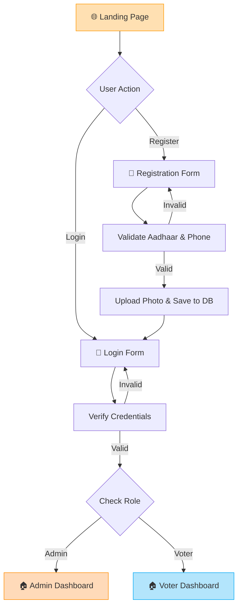
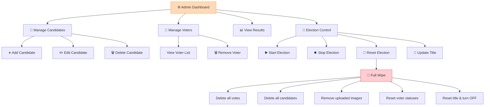
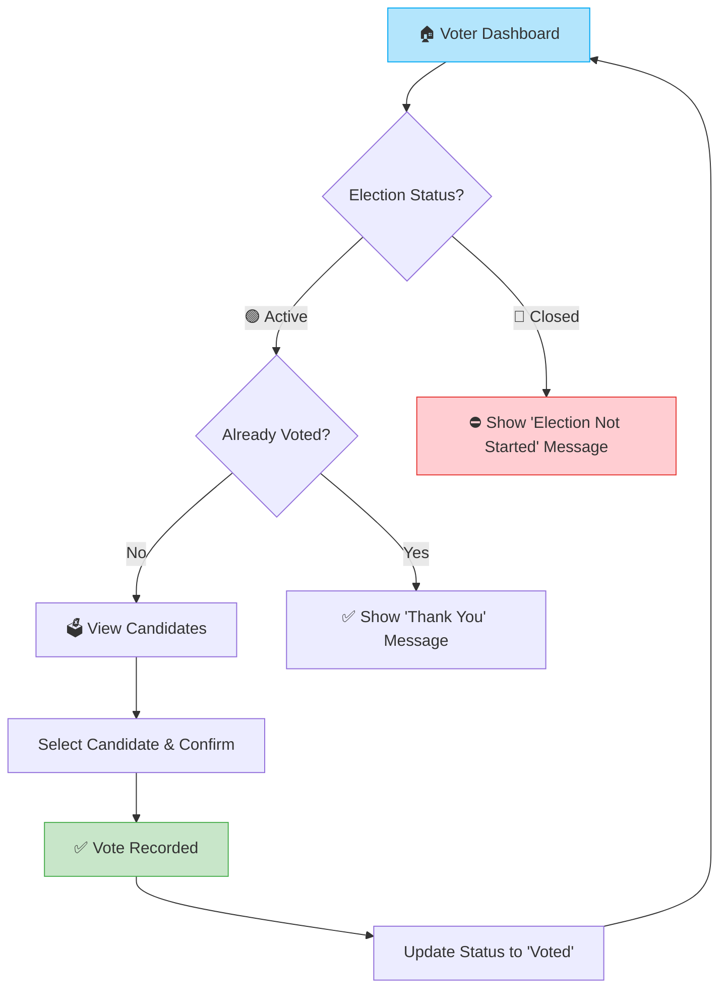

# 🗳️ Online Voting System

A secure, web-based voting platform built with **PHP**, **MySQL**, and **XAMPP**. Designed for conducting transparent elections with a full-featured **Admin Panel** and an intuitive **Voter Dashboard**.

> 🏛️ *Built for Election Commission of India – MLA Elections*

---

## 📸 Screenshots

| Login Page | Admin Dashboard | Voter Dashboard |
|:---:|:---:|:---:|
| *Sunshine Orange Theme* | *Peach Theme* | *Light Blue Theme* |

---

## ✨ Features

### 🔐 Authentication
- Phone number & password-based login
- Secure password hashing using `bcrypt` (`password_hash`)
- Role-based access control (**Admin** / **Voter**)
- Session management with auto-redirect

### 👤 Voter Portal
- **Registration** with Name, Phone, Aadhaar (12-digit), Address & Photo upload
- **Dashboard** with real-time voting & election status
- **Vote page** that only shows candidates when the election is active
- One-person-one-vote enforcement (double voting prevention)
- Clean "election not started" message when voting is closed

### ⚙️ Admin Panel
- **Dashboard** with live stats — Registered Voters, Candidates, Votes Cast, Turnout %
- **Candidate Management** — Add, Edit, Delete candidates with photo & manifesto
- **Voter Management** — View all voters with status, Remove voters
- **Election Control** — Start/Stop election, Update election title
- **Live Results** — Real-time vote tallies with progress bars & winner badge
- **Full Reset** — Wipes all votes, candidates, images & resets title (fresh start)

### 🎨 UI/UX
- **Glassmorphism** design with frosted-glass buttons
- Role-based color themes:
  - 🟠 **Login/Register** → Sunshine Orange
  - 🍑 **Admin pages** → Peach
  - 🔵 **Voter pages** → Light Blue
- Smooth animations & hover effects
- Fully responsive layout
- Google Fonts (Outfit)

---

## 🛠️ Tech Stack

| Layer | Technology |
|-------|-----------|
| **Frontend** | HTML5, CSS3, JavaScript |
| **Backend** | PHP 8+ |
| **Database** | MySQL (via MySQLi) |
| **Server** | XAMPP (Apache + MySQL) |
| **Fonts** | Google Fonts – Outfit |
| **Design** | Glassmorphism, CSS Gradients |

---

## 🔄 Application Flowchart

### Overall System Flow



### Admin Workflow



### Voter Workflow



---

## 🗂️ Project Structure

```
Online_voting/
│
├── index.html              # 🔐 Login & Registration page
├── register.html           # 📝 Alternate registration page
├── login.php               # 🔑 Login authentication handler
├── register.php            # 📥 Registration handler with image upload
├── logout.php              # 🚪 Session destroy & redirect
│
├── dashboard.php           # 🏠 Voter dashboard
├── vote.php                # 🗳️ Voting page (candidates list)
├── submit_vote.php         # ✅ Vote submission handler
│
├── admin_dashboard.php     # ⚙️ Admin dashboard with stats
├── candidates.php          # 👥 Manage candidates (list view)
├── add_candidate.php       # ➕ Add new candidate form
├── edit_candidate.php      # ✏️ Edit candidate form
├── delete_candidate.php    # 🗑️ Delete candidate handler
├── manage_voters.php       # 👥 View & remove voters
├── delete_voter.php        # 🗑️ Delete voter handler
├── results.php             # 📊 Live election results
│
├── toggle_election.php     # 🚦 Start/Stop election
├── update_title.php        # 💾 Update election title
├── reset.php               # 🔄 Full election reset
├── get_title.php           # 📡 API: Get election title (JSON)
│
├── config.php              # 🔌 Database connection
├── navbar.php              # 🧭 Dynamic navbar + role-based themes
├── hash.php                # 🔑 Password hash utility
│
├── style.css               # 🎨 Complete stylesheet (glassmorphism)
├── script.js               # ⚡ Client-side validation & utilities
│
├── uploads/                # 🖼️ Uploaded voter photos
├── faces/                  # 🖼️ Face images directory
└── assests/                # 📁 Static assets
```

---

## 🗄️ Database Schema

### Database: `online_voting`

#### `users` Table
| Column | Type | Description |
|--------|------|-------------|
| `id` | INT (PK, AI) | User ID |
| `name` | VARCHAR | Full name |
| `phone` | VARCHAR | Phone number (unique) |
| `aadhaar` | VARCHAR(12) | Aadhaar number (unique) |
| `address` | TEXT | Residential address |
| `password` | VARCHAR | Bcrypt hashed password |
| `role` | ENUM('voter','admin') | User role |
| `image` | VARCHAR | Profile image path |
| `status` | VARCHAR | `approved` / `voted` |

#### `candidates` Table
| Column | Type | Description |
|--------|------|-------------|
| `id` | INT (PK, AI) | Candidate ID |
| `name` | VARCHAR | Candidate name |
| `party` | VARCHAR | Political party |
| `manifesto` | TEXT | Election manifesto |
| `image` | VARCHAR | Candidate image path |

#### `votes` Table
| Column | Type | Description |
|--------|------|-------------|
| `id` | INT (PK, AI) | Vote ID |
| `user_id` | INT (FK) | Voter who cast the vote |
| `candidate_id` | INT (FK) | Candidate voted for |

#### `settings` Table
| Column | Type | Description |
|--------|------|-------------|
| `id` | INT (PK) | Settings ID (always 1) |
| `election_status` | ENUM('ON','OFF') | Election active status |
| `election_title` | VARCHAR | Custom election title |

---

## 🚀 Installation & Setup

### Prerequisites
- [XAMPP](https://www.apachefriends.org/) installed (Apache + MySQL)
- PHP 8.0+
- Web browser

### Steps

1. **Clone the repository**
   ```bash
   git clone https://github.com/your-username/Online_voting.git
   ```

2. **Move to XAMPP's htdocs**
   ```bash
   # Copy the project folder to:
   C:\xampp\htdocs\Online_voting
   ```

3. **Start XAMPP**
   - Open XAMPP Control Panel
   - Start **Apache** and **MySQL**

4. **Create Database**
   - Open [phpMyAdmin](http://localhost/phpmyadmin)
   - Create a database named `online_voting`
   - Run the following SQL:

   ```sql
   CREATE TABLE users (
       id INT AUTO_INCREMENT PRIMARY KEY,
       name VARCHAR(100) NOT NULL,
       phone VARCHAR(15) UNIQUE NOT NULL,
       aadhaar VARCHAR(12) UNIQUE NOT NULL,
       address TEXT,
       password VARCHAR(255) NOT NULL,
       role ENUM('voter','admin') DEFAULT 'voter',
       image VARCHAR(255),
       status VARCHAR(20) DEFAULT 'approved'
   );

   CREATE TABLE candidates (
       id INT AUTO_INCREMENT PRIMARY KEY,
       name VARCHAR(100) NOT NULL,
       party VARCHAR(100),
       manifesto TEXT,
       image VARCHAR(255)
   );

   CREATE TABLE votes (
       id INT AUTO_INCREMENT PRIMARY KEY,
       user_id INT NOT NULL,
       candidate_id INT NOT NULL,
       FOREIGN KEY (user_id) REFERENCES users(id),
       FOREIGN KEY (candidate_id) REFERENCES candidates(id)
   );

   CREATE TABLE settings (
       id INT PRIMARY KEY DEFAULT 1,
       election_status ENUM('ON','OFF') DEFAULT 'OFF',
       election_title VARCHAR(255) DEFAULT 'Online Voting System'
   );

   -- Insert default settings
   INSERT INTO settings (id, election_status, election_title)
   VALUES (1, 'OFF', 'Online Voting System');

   -- Create admin user (password: admin123)
   INSERT INTO users (name, phone, password, role, status)
   VALUES ('Admin', '9999999999', '$2y$10$YOUR_HASH_HERE', 'admin', 'approved');
   ```

   > 💡 **Tip:** Use `hash.php` to generate a password hash. Edit the file with your desired password, navigate to `http://localhost/Online_voting/hash.php`, and copy the output.

5. **Access the application**
   ```
   http://localhost/Online_voting/
   ```

---

## 🔒 Security Features

- ✅ Password hashing with `bcrypt`
- ✅ Session-based authentication
- ✅ Role-based access control
- ✅ Double-vote prevention
- ✅ Election status enforcement on vote submission
- ✅ Confirmation dialogs for destructive actions
- ✅ Admin-only route protection

---

## 📋 Future Enhancements

- [ ] OTP-based phone verification (Firebase)
- [ ] Face recognition for voter identity
- [ ] Email notifications for election events
- [ ] Voter ID card generation (PDF)
- [ ] Audit logs for admin actions
- [ ] Multi-election support
- [ ] Dark mode toggle

---

## 🤝 Contributing

1. Fork the repository
2. Create your feature branch (`git checkout -b feature/AmazingFeature`)
3. Commit your changes (`git commit -m 'Add some AmazingFeature'`)
4. Push to the branch (`git push origin feature/AmazingFeature`)
5. Open a Pull Request

---

## 📄 License

This project is licensed under the **MIT License** — see the [LICENSE](LICENSE) file for details.

---

<div align="center">

**Made with ❤️ for transparent & secure elections**

⭐ *Star this repo if you found it useful!* ⭐

</div>
